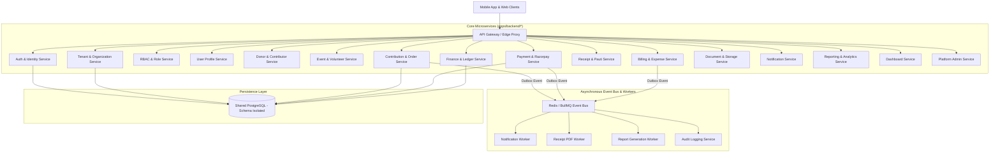

# Target Microservices System Architecture Diagram

```mermaid
graph TD
    Client[Mobile App & Web Clients] --> Gateway[API Gateway / Edge Proxy]

    subgraph "Core Microservices (apps/backend/*)"
        Gateway --> AuthSvc[Auth & Identity Service]
        Gateway --> TenantSvc[Tenant & Organization Service]
        Gateway --> RoleSvc[RBAC & Role Service]
        Gateway --> UserSvc[User Profile Service]
        Gateway --> DonorSvc[Donor & Contributor Service]
        Gateway --> EventSvc[Event & Volunteer Service]
        Gateway --> OrderSvc[Contribution & Order Service]
        Gateway --> BillSvc[Billing & Expense Service]
        Gateway --> PaymentSvc[Payment & Razorpay Service]
        Gateway --> ReceiptSvc[Receipt & Pauti Service]
        Gateway --> FinanceSvc[Finance & Ledger Service]
        Gateway --> DocSvc[Document & Storage Service]
        Gateway --> NotifSvc[Notification Service]
        Gateway --> ReportSvc[Reporting & Analytics Service]
        Gateway --> DashSvc[Dashboard Service]
        Gateway --> AdminSvc[Platform Admin Service]
    end

    subgraph "Asynchronous Event Bus & Workers"
        OrderSvc -->|Outbox Event| EventBus[Redis / BullMQ Event Bus]
        PaymentSvc -->|Outbox Event| EventBus
        BillSvc -->|Outbox Event| EventBus
        
        EventBus --> NotifWorker[Notification Worker]
        EventBus --> PDFWorker[Receipt PDF Worker]
        EventBus --> ReportWorker[Report Generation Worker]
        EventBus --> AuditWorker[Audit Logging Service]
    end

    subgraph "Persistence Layer"
        AuthSvc --> DB[(Shared PostgreSQL - Schema Isolated)]
        TenantSvc --> DB
        OrderSvc --> DB
        PaymentSvc --> DB
        FinanceSvc --> DB
    end
```
