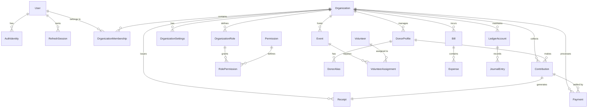

# Entity Relationship Diagram (ERD)

```mermaid
erDiagram
    User ||--o{ AuthIdentity : "has"
    User ||--o{ RefreshSession : "owns"
    User ||--o{ OrganizationMembership : "belongs to"

    Organization ||--o{ OrganizationMembership : "contains"
    Organization ||--o{ OrganizationRole : "defines"
    Organization ||--o{ OrganizationSettings : "has"
    Organization ||--o{ DonorProfile : "manages"
    Organization ||--o{ Event : "hosts"
    Organization ||--o{ Contribution : "collects"
    Organization ||--o{ Bill : "incurs"
    Organization ||--o{ Receipt : "issues"
    Organization ||--o{ Payment : "processes"
    Organization ||--o{ LedgerAccount : "maintains"

    OrganizationRole ||--o{ RolePermission : "grants"
    Permission ||--o{ RolePermission : "defines"

    DonorProfile ||--o{ DonorAlias : "has"
    DonorProfile ||--o{ Contribution : "makes"

    Event ||--o{ VolunteerAssignment : "requires"
    Volunteer ||--o{ VolunteerAssignment : "assigned to"

    Contribution ||--|| Receipt : "generates"
    Contribution ||--o{ Payment : "settled by"

    Bill ||--o{ Expense : "contains"
    LedgerAccount ||--o{ JournalEntry : "records"
```
